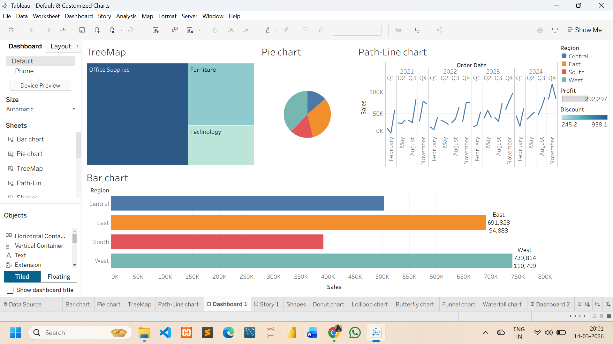
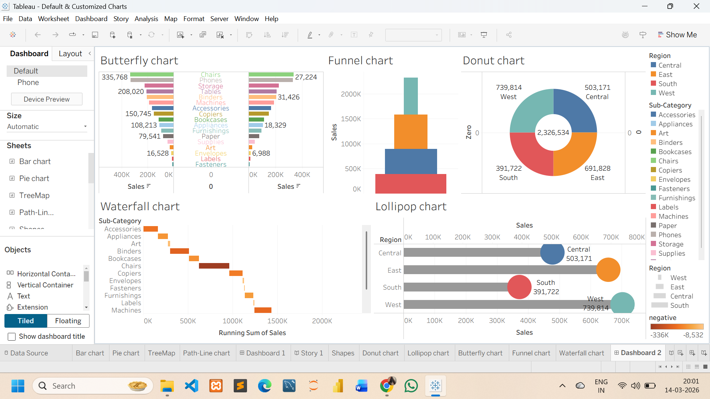

## Project Title
Tableau Superstore Sales Dashboard

## Project Description
This project analyzes retail sales performance using the Superstore Sales dataset and demonstrates various data visualization techniques in Tableau. The goal of this project is to explore sales distribution across different regions, understand category-level contributions, and identify sales trends over time through an interactive dashboard.

## Dataset

## Tools Used
- Tableau Public
- CSV Dataset
- Tableau Worksheets
- Tableau Dashboard
- Data Visualization Techniques

## Visualizations Created
- Bar Chart – Shows the comparison of total sales across different regions.
- Pie Chart – Displays the proportion of total sales contributed by each region.
- Tree Map – Visualizes category-wise sales distribution using size and color differences.
- Line Chart – Represents the sales trend over time across months and years.
- Donut Chart – Illustrates the percentage contribution of different categories to total sales.
- Funnel Chart – Shows the hierarchical distribution of sales across categories and sub-categories.
- Waterfall Chart – Highlights how individual categories contribute to the overall sales total.
- Butterfly Chart – Compares sales performance between two categories across sub-categories.
- Lollipop Chart – Displays category-wise sales values using a cleaner alternative to a bar chart.

## Dashboard images

## Key Insights
- The West region recorded the highest total sales, followed by the East region.
- The South region shows comparatively lower sales performance among all regions.
- Office Supplies contributes a significant portion of the total sales distribution.
- Sales trends fluctuate across months and years, indicating varying demand patterns.

## Dashboard Features
- Region-wise sales comparison
- Category-level sales distribution
- Time-based sales trend analysis
- Multiple customized visualization techniques

## Project Outcome
This project helped improve my skills in data visualization, dashboard design, and analytical storytelling using Tableau.

## Author
Bhavadharani Ravindran
